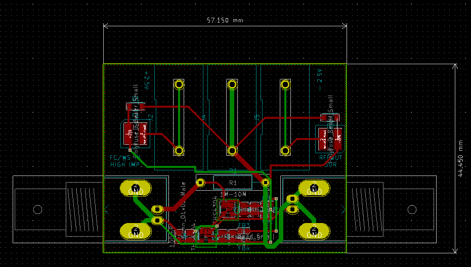
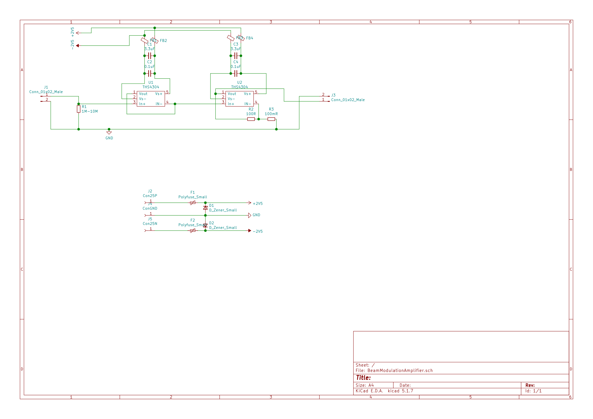

# Simple combined buffer and 1001x amplifier

This is a simple circuit that combines two OpAmps with 1 GHz
bandwidth to form a buffer amplifier followed by an 1001 times
amplifying amplifier.

This circuit has been designed to measure the beam profile of
an low current electron beam. The shunt has been designed as wire
resistor to be easily adaptable. The OpAmps have been selected
with up to 1 GHz bandwidth to allow for measurement of deflection
frequency inside an modulated beam.

